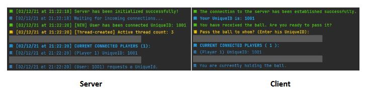

# Virtual Ball-Passing Game

## Table of Contents

- [Introduction](#introduction)
- [Implemented Functionality](#implemented-functionality)
- [System Behavior](#system-behavior)
- [Protocol](#protocol)
  - [Server-Side Protocols](#server-side-protocols)
  - [Client-Side Protocols](#client-side-protocols)
- [Client Threads](#client-threads)
- [Server Threads](#server-threads)

## Introduction

In this project, we built a socket-based system for a server and multiple clients. The system revolves around a virtual ball that can be passed among the clients. The server is responsible for handling, validating, and updating the clients with events in the game, such as new client connections or disconnections, and the passing of the ball between clients.

## Implemented Functionality

The following table outlines the features implemented in the Server-Client socket architecture:

| MODULE | FUNCTION | STATUS |
|--------|----------|--------|
| CLIENT | Establishes a connection with the server | ✔️ |
| CLIENT | Is assigned a unique ID when joining the game | ✔️ |
| CLIENT | Displays up-to-date information about the game state | ✔️ |
| CLIENT | Allows passing the ball to another player | ✔️ |
| SERVER | Manages multiple client connections | ✔️ |
| SERVER | Accepts connections during the game | ✔️ |
| SERVER | Correctly handles clients leaving the game | ✔️ |

## System Behavior

- **Establishing Connection**: Server and client establish a connection and the server assigns a unique ID to the client.
- **Passing the Ball**: The ball can be passed between two clients.
- **Accepting New Connections**: The server can accept new clients even during an ongoing game.
- **Player Disconnect**: When a player holding the ball leaves, the ball is passed to another randomly chosen connected client.

## Protocol

### Server-Side Protocols

- **CONNECTED_SUCCESSFULLY**: Sent to the client upon a successful connection.
- **UUID**: Sends the player's unique ID after the client requests it.
- **CURRENT_PLAYERS_LIST**: Sends the list of current players connected.
- **BALL_PASSED**: Informs the client that the ball has been passed.
- **BALL_RECEIVED**: Sent to the client currently holding the ball.
- **CURRENT_BALL_OWNER**: Sent upon request to inform of the current ball holder.
- **CONNECTED_PLAYER**: Informs about a new connected player.
- **DISCONNECTED_PLAYER**: Informs about a disconnected player.

### Client-Side Protocols

- **UNIQUE_ID**: Requests the client's unique ID.
- **BALL_PASS**: Requests to pass the ball to another player.
- **BALL_OWNER**: Requests information about the current ball holder.
- **CURRENT_PLAYERS**: Requests a list of currently connected players.

## Client Threads

The client side uses two main threads:

### Thread 1
- **Purpose**: This is the main thread responsible for initializing the client socket and handling all Socket writer commands. It also manages the scanner used for prompting the user to input the unique ID of the player to whom the ball will be passed.
- **Termination**: This thread is terminated when the client is closed or killed.

### Thread 2
- **Purpose**: This thread is responsible for handling server communication to prevent the server protocols reader from being blocked by the client's scanner thread.
- **Termination**: This thread is also terminated when the client is closed or killed.

## Server Threads

The server side uses two main threads:

### Main Thread
- **Purpose**: This is the thread for the main method.
- **Termination**: This thread is terminated when the server process is closed or killed.

### Socket Initialization Thread
- **Purpose**: This thread initializes the socket and waits for accepting any upcoming new connections. Upon a new connection, it starts a new thread to handle the communication between the new client and the server.
- **Client Threads**: Each of these new threads is terminated when the socket is closed after catching an error during data read, which indicates that the client connection has been lost (Client has been closed or killed).
- **Termination**: This thread is also terminated when the server process is closed or killed.
